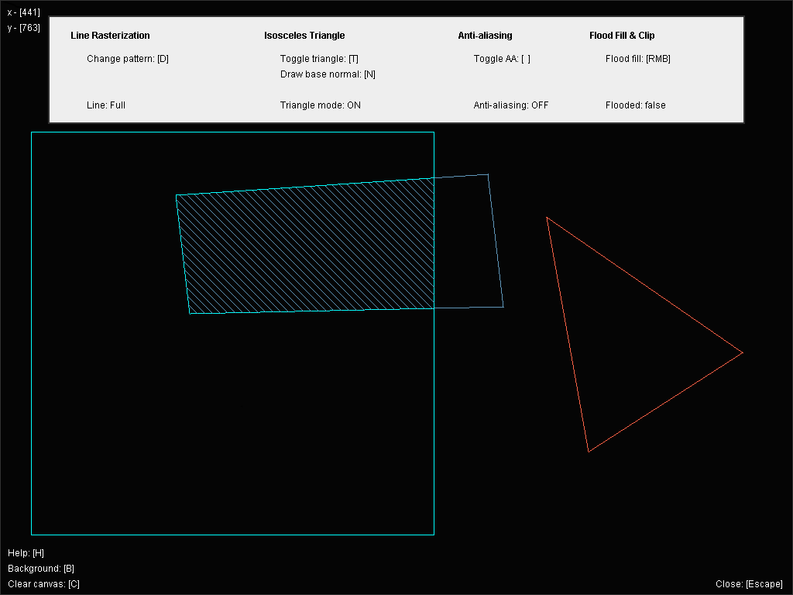

# Polyline
Line rasterizer written in Java 8 with multiple additional features.

## Checklist
- [x] line clipping
- [x] line preview
- [x] line rasterization
- [x] isosceles triangle rasterization
- [x] flood fill
- [x] scanline fill
- [x] anti-aliasing

## Dependencies
- [Java 8 and above](https://www.java.com/en/)